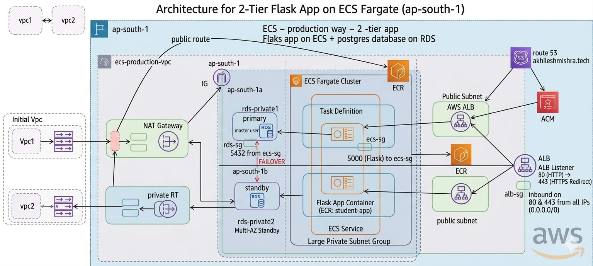

# AWS Networking Project: Manual Deployment (2-Tier App)

This repository documents the manual implementation of my 2-tier application architecture via the AWS Management Console. 

## 🏗 Architecture Components
This project established the foundation for the automated version, including:
* **VPC:** Custom VPC setup with dedicated subnets for production workloads.
* **ALB & ECS:** Manually configured the Application Load Balancer, Target Groups, and ECS Cluster settings.
* **RDS:** Provisioned RDS primary/standby instances in private subnets with custom Parameter Groups.
* **Routing:** Manually mapped Route Tables to manage traffic flow between the Public ALBs and Private Application/Database tiers.

## 🏗 Documentation
Refer to the "Deploying 2 tier app on ECS.docx" file in day2_day3 folder to see the screenshots fo the various resources created and walkthrough steps.

## 💡 Why This Was Crucial
By manually configuring this exact architecture, I learned:
1. **The "Why" behind the "How":** Understanding why the ECS tasks needed to be in private subnets while the ALB required public placement.
2. **Security Group Complexity:** The nuances of opening inbound ports (80/443 on ALB) and restricting backend database access (5432) only to the ECS security group.
3. **Operational Discipline:** Manually documenting every manual click allowed me to identify exactly where automation was needed, directly informing the development of my terrform project implementation.

---

## 📂 Architecture Diagram

